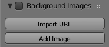

# Import URL as Background
This addon adds a button to the Properties panel's "Background Images" section to import any image URL as a background image.

This is my first Blender addon, so if you run into any bugs, either let me know or make a pull request. If you can improve the code, feel free!

## Credits
[Popup dialog tutorial](http://wiki.blender.org/index.php/Dev:Py/Scripts/Cookbook/Code_snippets/Interface#A_popup_dialog) in the Blender Cookbook

